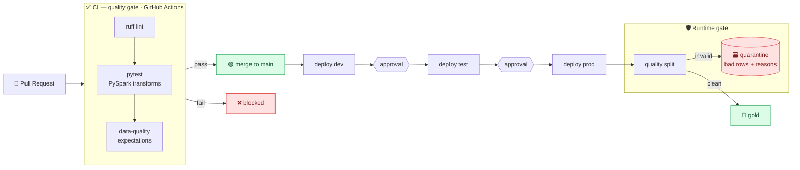

# 🛡️ DataOps — CI/CD Lakehouse with Data-Quality Gates

[](../../actions/workflows/ci.yml)


> **Broken data can't reach prod — the pipeline gates it.**
> Every push runs `ruff` + **PySpark unit tests** + a **data-quality gate**. A pull request that
> introduces bad *data* — not just bad code — is **blocked**. At runtime, bad rows are
> **quarantined** with the reason they failed, never silently shipped. Promotion flows
> **dev → test → prod** behind GitHub environment approvals.

📖 **Docs:** [Step-by-step build](docs/WALKTHROUGH.md) · [Case study & lessons learned](docs/CASE-STUDY.md)

---

## 🗺️ Architecture



---

## 🛡️ What's gated

| Stage | Check | On failure |
|-------|-------|-----------|
| PR / push | `ruff` lint | block merge |
| PR / push | `pytest` — PySpark transforms | block merge |
| PR / push | **data-quality gate** on the feed | **block merge** |
| PR / push | Bicep build + Terraform validate | block merge |
| PR (data change) | **data-diff** comment (rows · distributions · new values · nulls) | informational |
| Deploy | environment approval (test, prod) | pause for review |
| Runtime | expectation split | **quarantine** bad rows |

---

## 🧠 Why it's senior (not a toy)

| Concern | How it's handled |
|---------|------------------|
| **Test the data, not just the code** | a green build can still fail because the *data* is wrong — the gate runs the same expectations CI checks and runtime enforces |
| **Unit-testing Spark** | pure `DataFrame → DataFrame` transforms + a local `SparkSession` fixture keep tests fast and CI-friendly |
| **Deterministic parsing** | the feed is read as **strings** so a bad number stays bad (it can be *caught*), instead of silently parsing to `null` |
| **Honest null semantics** | a null predicate result counts as **invalid**, never "unknown" — no bad row slips through on a null |
| **Quarantine, not fail-closed** | one bad upstream day doesn't stop delivery — good rows flow, bad rows are isolated and countable |
| **Promotion with approvals** | GitHub **environments** gate `test` and `prod` — a clean audit trail for every change |
| **Portable IaC** | the same infra in **Bicep _and_ Terraform**, both validated in CI |

---

## ✅ Proof — the gate in action

### ❌ A PR with broken data is blocked *(the money shot)*
[PR #1](https://github.com/sourabhxmishra/dataops-lakehouse/pull/1) adds four rows with a typo'd
status, a null customer, a negative amount, and an unsupported currency. `ruff` and the PySpark
tests **pass** — the code is fine — but the **data-quality gate fails**, so the PR can't merge.


Real gate output from that run:

```text
  customer_id_not_null       customer_id  FAIL (1)
  quantity_positive          quantity     FAIL (1)
  amount_non_negative        amount       FAIL (1)
  status_in_set              status       FAIL (1)
  currency_in_set            currency     FAIL (1)
GATE FAILED — 5 violation(s). Broken data blocked from prod.
```

### ✅ Clean data passes every gate
On `main`, lint + PySpark tests + the data-quality gate + the quarantine demo + Bicep/Terraform
validation are all green.


### 🗃️ Runtime quarantine — bad rows isolated with reasons
At runtime a mixed batch is split: clean rows go to gold; bad rows go to quarantine tagged with the
exact expectations they failed. Real output from the CI **quarantine demo** step:

```text
Runtime quality gate — batch of 14 rows
  clean       -> gold        : 10
  quarantined -> quarantine  : 4
+--------+----------+--------+--------+------+----------------------------------------+
|order_id|status    |currency|quantity|amount|_dq_reasons                             |
+--------+----------+--------+--------+------+----------------------------------------+
|O-9001  |teleported|USD     |1       |10.0  |[status_in_set]                         |
|O-9002  |placed    |USD     |2       |20.0  |[customer_id_not_null]                  |
|O-9003  |placed    |USD     |-3      |-30.0 |[quantity_positive, amount_non_negative]|
|O-9004  |shipped   |BTC     |1       |10.0  |[currency_in_set]                       |
+--------+----------+--------+--------+------+----------------------------------------+
```

### 🔐 dev → test → prod behind approvals
Promotion is gated by GitHub **environments**: `dev` deploys automatically, while **`test` and
`prod` require a reviewer to approve** before the deployment proceeds.

```yaml
# .github/workflows/cd.yml — each stage runs only after the previous, behind an approval
deploy-test:
  needs: deploy-dev
  environment: test        # required reviewer
deploy-prod:
  needs: deploy-test
  environment: prod        # required reviewer
```

### 📊 Data-diff on every data PR
Any PR that touches the feed gets an auto-comment summarizing the **data** impact — so a reviewer
catches a suspicious new `status` or a spike in null keys *before* merge. Real comment on
[PR #1](https://github.com/sourabhxmishra/dataops-lakehouse/pull/1):

> **Rows:** 10 → 14  (**+4**)
> - **status** — `teleported` **new ⚠️** (0 → 1) · `placed` +2 · `shipped` +1
> - **currency** — `BTC` **new ⚠️** (0 → 1) · `USD` +3
> - **Null / empty cells** — `customer_id` 0 → 1
> - **Σ amount:** 948.45 → 1,023.45

---

## 🔎 The gate, in code

Expectations are plain predicates that are **True when a row is valid** — shared by CI (block) and
runtime (quarantine):

```python
def orders_suite():
    return [
        Expectation("order_id_not_null",      "order_id",   not_null("order_id")),
        Expectation("quantity_positive",      "quantity",   positive("quantity")),
        Expectation("amount_non_negative",    "amount",     non_negative("amount")),
        Expectation("status_in_set",          "status",     in_set("status", ORDER_STATUSES)),
        Expectation("currency_in_set",        "currency",   in_set("currency", CURRENCIES)),
    ]
```

The **CI gate** runs the suite and exits non-zero on any violation (that's what blocks the PR). The
**runtime quarantine** uses the same suite to tag and split each batch:

```python
clean, quarantined = split(batch, orders_suite())   # clean → gold, bad → quarantine (+ _dq_reasons)
```

### 🔔 Slack alerts (optional)
Set a **`SLACK_WEBHOOK_URL`** repo secret and the gate posts its pass/fail summary — with the
failing expectations — to Slack on every run. It's a clean no-op until the secret exists (and the
URL is restricted to `hooks.slack.com` to avoid SSRF), so CI stays green either way.

---

## 🧱 Tech stack

PySpark (unit-tested transforms + quality engine) · `pytest` + `ruff` · GitHub Actions (CI/CD +
environment approvals) · **Bicep + Terraform** IaC · Azure Databricks + ADLS Gen2 medallion (the
deploy target)

---

## 📁 Repo structure

```text
dataops-lakehouse/
├── .github/workflows/
│   ├── ci.yml                  # PR/push: ruff + pytest + data-quality gate + IaC validate
│   ├── cd.yml                  # manual promotion: dev → test → prod (environment approvals)
│   └── data-diff.yml           # PR: comment a data-diff on feed changes
├── src/
│   ├── transforms/orders.py    # pure, testable PySpark transforms
│   └── quality/
│       ├── expectations.py     # tiny GE-style expectation engine (shared by CI + runtime)
│       ├── quarantine.py       # split a batch → clean vs quarantined (+ reasons)
│       ├── gate.py             # CI gate — exits non-zero on any violation
│       ├── demo.py             # runtime quarantine demo (clean vs quarantined)
│       └── data_diff.py        # PR data-diff (row-count + distribution shifts)
├── tests/                      # pytest — local SparkSession fixture
│   ├── conftest.py
│   ├── test_transforms.py
│   ├── test_quality.py
│   └── test_data_diff.py
├── infra/
│   ├── main.bicep + modules/   # env-parameterized (dev/test/prod)
│   └── terraform/              # same infra, Terraform variant
├── data/orders.csv             # the feed (data-as-code — a bad-data PR fails CI)
├── requirements.txt · pyproject.toml
└── README.md
```

---

## ▶️ Run it locally

```bash
pip install -r requirements.txt
ruff check src tests
pytest -q                                  # PySpark unit tests
python -m src.quality.gate data/orders.csv # the data-quality gate (exit code = pass/fail)
python -m src.quality.demo                 # runtime quarantine split
python -m src.quality.data_diff a.csv b.csv # data-diff between two feed versions
```

> Requires Python 3.11/3.12 + Java 17 (for Spark). CI runs exactly these steps on every push.

---

## 💸 Cost

**$0.** The entire pipeline — tests, the data-quality gate, the quarantine split, and IaC
validation — runs on **GitHub Actions**. The Bicep/Terraform is proven by **building and
validating** in CI; nothing is deployed to Azure just to prove it works. For a DataOps project the
CI/CD *is* the deliverable.

---

## 🎓 What I learned

- **Test the data, not just the code.** Schema-valid garbage is the sneakiest bug — a gate that
  runs data expectations in CI turns "someone noticed days later" into "the PR was blocked."
- **Read raw, validate typed.** Parsing the feed as strings keeps bad values *catchable* instead of
  silently coercing them to `null`.
- **Quarantine beats fail-closed.** Isolating bad rows (with reasons) keeps good data flowing while
  making the bad data countable and triageable.
- **One expectation suite, two enforcers.** Sharing the predicates between the CI gate and the
  runtime split guarantees what you test is what you enforce.
- **Keep the badge honest.** CD is `workflow_dispatch` so the repo stays green without cloud
  credentials, while still shipping a faithful dev→test→prod promotion with approvals.

---

## 🗺️ Roadmap

- [x] Pure, unit-tested PySpark transforms
- [x] GE-style expectation engine (shared by CI gate + runtime quarantine)
- [x] CI: ruff + pytest + data-quality gate + Bicep/Terraform validate
- [x] CD: dev → test → prod with environment approvals
- [x] Proof: bad-data PR blocked · clean PR green · quarantine split ✅
- [x] **data-diff on PRs** — every feed change gets a row-count + distribution diff commented on the PR
- [x] **Slack summary of the gate results** — posts pass/fail (+ failing expectations) to a webhook when `SLACK_WEBHOOK_URL` is set
- [ ] **Next** — Great Expectations / Databricks DQX at scale on a live medallion
