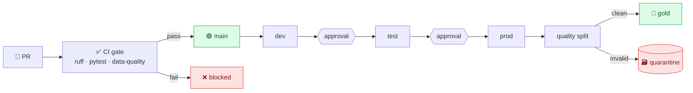

# 🛠️ Build Walkthrough — DataOps CI/CD Lakehouse

A reproducible build of a lakehouse wrapped in a real **DataOps** pipeline: PySpark transforms are
unit-tested, the *data itself* is validated by a quality gate, bad rows are quarantined, and
promotion flows **dev → test → prod** behind approvals. Every step runs on **GitHub Actions** — the
proof is the green/red pipeline, not a screenshot of a resource group.

> **Cost:** $0. Everything here runs in CI. The IaC is proven by building/validating, not deploying.

---

## 🗺️ Architecture



---

## 0 · Prerequisites

| Tool | Purpose |
|------|---------|
| Python 3.11/3.12 + Java 17 | run PySpark transforms + tests |
| `ruff`, `pytest` | lint + unit tests |
| A GitHub repo | CI/CD + environment approvals |
| (optional) Azure CLI / Terraform | build & validate the IaC locally |

---

## Phase 1 · Pure, testable transforms

`src/transforms/orders.py` holds plain `DataFrame → DataFrame` functions — no I/O, no globals — so
they run identically in a local `SparkSession` (CI) and on Databricks.

```python
def clean_orders(df):
    q = F.col("quantity").cast(T.IntegerType())
    p = F.col("unit_price").cast(T.DoubleType())
    return (df
        .withColumn("status", F.lower(F.trim("status")))
        .withColumn("quantity", q).withColumn("unit_price", p)
        .withColumn("amount", F.coalesce(F.col("amount").cast(T.DoubleType()), F.round(q * p, 2))))
```

The feed is read **as strings** (`read_orders_csv`) so a bad number stays a bad number the gate can
catch — not a silent `null`.

---

## Phase 2 · The expectation engine (shared by CI + runtime)

`src/quality/expectations.py` is a tiny Great-Expectations-style engine. Each expectation is a
predicate that's **True when a row is valid**; a null result counts as **invalid**.

```python
Expectation("status_in_set", "status", in_set("status", ORDER_STATUSES))
```

`src/quality/quarantine.py` reuses those predicates to tag and split a batch:

```python
clean, quarantined = split(batch, orders_suite())   # bad rows keep _dq_reasons
```

---

## Phase 3 · Two enforcers, one suite

- **CI gate** (`src/quality/gate.py`) — runs the suite and **exits non-zero** on any violation.
  This is what blocks a bad-data PR.
- **Runtime quarantine** (`src/quality/demo.py`) — splits a live batch: clean → gold, invalid →
  quarantine with reasons.

```bash
python -m src.quality.gate data/orders.csv   # exit 0 = pass, 1 = blocked
python -m src.quality.demo                   # clean vs quarantined
```

---

## Phase 4 · Unit tests (fast Spark)

`tests/conftest.py` provides a session-scoped local `SparkSession`; `tests/` cover the transforms,
the expectations, the quarantine split, and duplicate-key detection.

```bash
pytest -q
```

---

## Phase 5 · CI — the quality gate

`.github/workflows/ci.yml` runs on every push/PR:

```text
quality: ruff → pytest (PySpark) → data-quality gate → quarantine demo
iac:     az bicep build  +  terraform init -backend=false && validate
```

**Clean data → green.** A PR that edits `data/orders.csv` to add bad rows → the gate exits
non-zero → **red, merge blocked**:


Real output from the CI **quarantine demo** step:

```text
Runtime quality gate — batch of 14 rows
  clean       -> gold        : 10
  quarantined -> quarantine  : 4
```

A separate **`data-diff.yml`** workflow comments a data-diff on any PR that touches `data/**` —
row-count, distribution shifts, brand-new values, and null rates — so the *data* impact is visible
in the PR before merge.

---

## Phase 6 · CD — promotion with approvals

`.github/workflows/cd.yml` is a manual (`workflow_dispatch`) promotion: `deploy-dev → deploy-test →
deploy-prod`. The `test` and `prod` jobs use GitHub **environments** with **required reviewers**, so
a human approves before each stage — `dev` deploys automatically, while `test` and `prod` require a
reviewer to approve first.

> Keeping CD manual (not on every push) keeps the badge green without needing cloud credentials in
> the repo, while still shipping a faithful, approval-gated promotion.

---

## Phase 7 · Portable IaC (Bicep + Terraform)

`infra/` ships the same medallion + quarantine storage and a Databricks workspace, env-parameterized
(`dev`/`test`/`prod`), in **both** Bicep and Terraform — each **built/validated in CI**:

```bash
az bicep build --file infra/main.bicep
cd infra/terraform && terraform init -backend=false && terraform validate
```

---

## 🎓 Takeaways

- A data-quality gate turns "bad data noticed days later" into "the PR was blocked."
- Read raw / validate typed so bad values stay catchable.
- Quarantine keeps good data flowing while isolating (and counting) the bad.
- One expectation suite enforced in both CI and runtime = what you test is what you ship.
